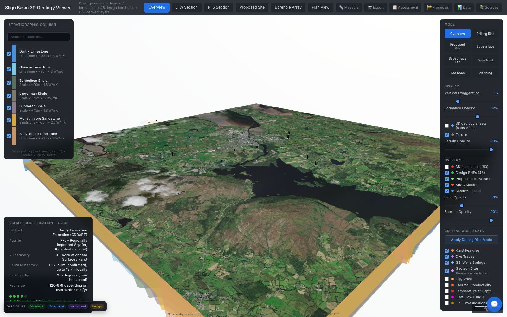
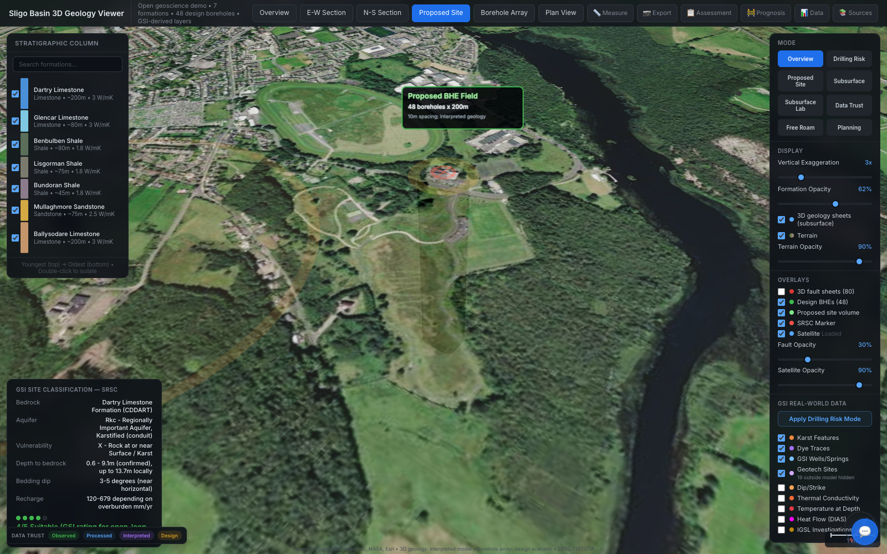
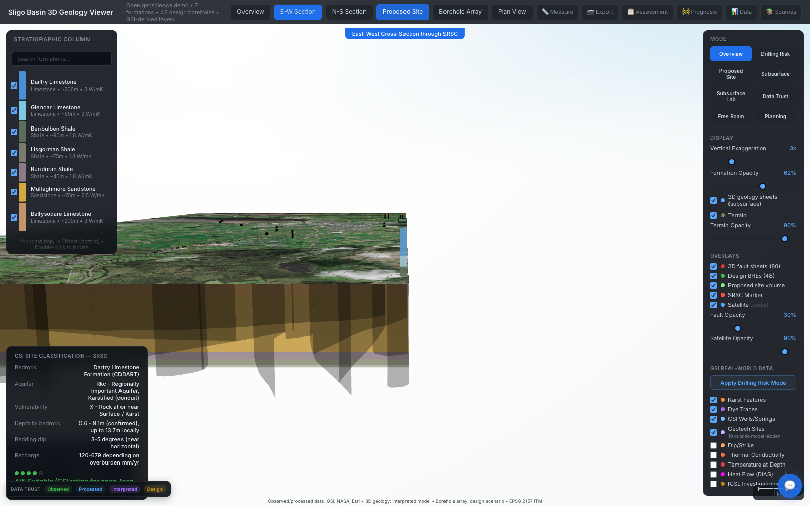
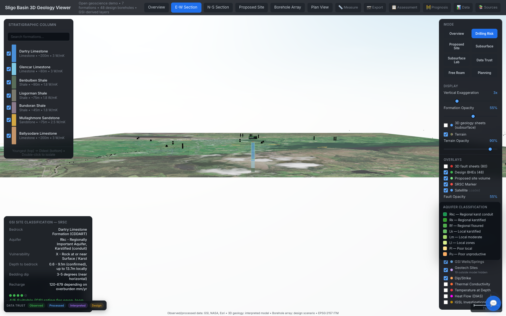
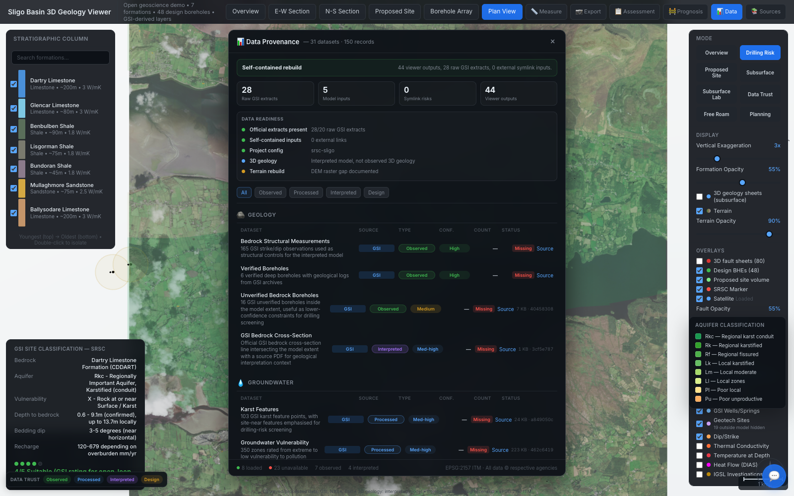

# Sligo Basin 3D Geology Viewer

An open geoscience portfolio project: a static Three.js viewer for an interpreted 3D geological model of the Sligo Basin, Ireland.

It turns public geoscience datasets into an interactive subsurface scene with formation surfaces, faults, borehole context, geothermal screening layers, groundwater/karst evidence, provenance labels, and drilling-risk workflows. No backend service is required.

**Live demo:** [Open the Sligo 3D viewer](https://sligo-digital-twin.vercel.app/?lang=en&crop=ireland&lon=-8.48221&lat=54.25329&elevation=50&heading=58&pitch=0&layers=srsc.marker%2Csligo.boreholes%2Csligo.faults%2Csligo.formation.ballysodare%2Csligo.formation.mullaghmore%2Csligo.formation.bundoran%2Csligo.formation.lisgorman%2Csligo.formation.benbulben%2Csligo.formation.glencar%2Csligo.formation.dartry%2Cgsi.bedrock.100k&layers_transparency=0%2C0%2C0.4%2C0.08%2C0.08%2C0.08%2C0.08%2C0.08%2C0.08%2C0.08%2C0.5)



## Highlights

- **Static-first deployment:** Vite builds the viewer into `output/viewer`, with JSON payloads served directly from `output/json`.
- **3D geoscience scene:** Seven interpreted Carboniferous formation surfaces, fault sheets, terrain, satellite imagery, and borehole/design context.
- **Risk-oriented workflows:** Drilling-risk mode, site assessment, prognosis, measurement, section views, and provenance panels.
- **Data transparency:** Public-source labels, confidence tags, and derived/observed/design distinctions are visible in the UI.
- **Open-source friendly:** The repo excludes private planning notes, local env files, raw bulk datasets, backend experiments, and third-party documents.

## Screenshots

| Overview | Proposed Site |
| --- | --- |
|  |  |

| Cross Section | Drilling Risk |
| --- | --- |
|  |  |

| Data Provenance |
| --- |
|  |

## Quick Start

```bash
npm install
npm run build
npm run serve
```

Open `http://localhost:9090/viewer/index.html`.

For development:

```bash
npm run dev
```

Open `http://localhost:9090/viewer/`.

## Commands

```bash
npm run build      # build static viewer into output/viewer
npm run serve      # serve output/ locally on port 9090
npm run test:e2e   # run the Playwright smoke test
```

## Data And Attribution

The included demo payloads are screening-level interpreted model outputs derived from public geoscience context and project assumptions. Geological, groundwater, geothermal, karst, borehole, and related spatial context may derive from public Irish geoscience sources, including Geological Survey Ireland.

Contains Irish Public Sector Data (Geological Survey Ireland) licensed under a Creative Commons Attribution 4.0 International (CC BY 4.0) licence.

The 3D model surfaces, borehole array, prognosis, and risk labels are derived interpretations. They are not certified engineering, drilling, hydrogeological, or planning assessments. Field investigation and authoritative source datasets should override conclusions from this viewer.

See `NOTICE` for attribution notes.

## Repository Scope

This public repo intentionally contains only the static viewer and minimal demo payloads needed to run it. It excludes:

- local secrets and `.env` files
- private planning/agent memory
- raw bulk datasets
- generated research output
- backend/API experiments
- third-party PDF/DOCX/PPTX source documents

## Tech Stack

- Three.js
- Vite
- Playwright
- Proj4
- Static JSON/GeoJSON payloads

## License

Code is released under the MIT License. Dataset-derived payloads retain their upstream attribution and licensing requirements; see `NOTICE`.
